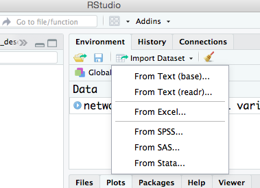
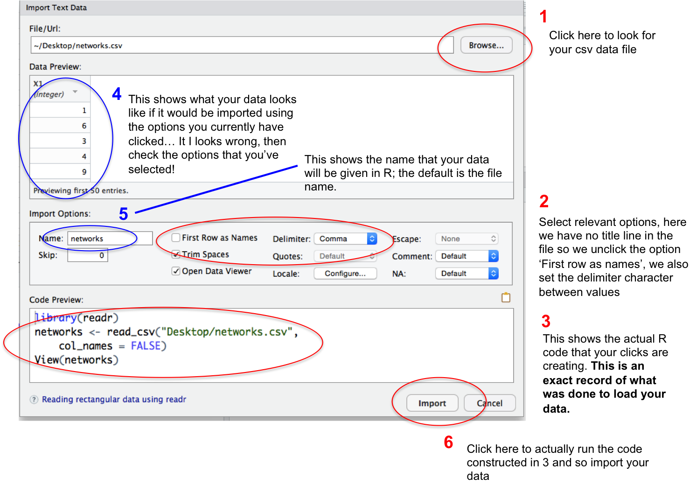
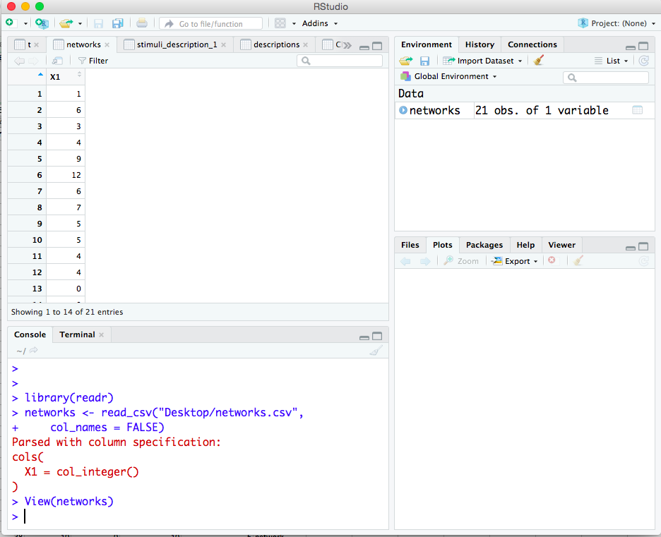

# Statistics for Multimodality: why, when, how – an invitation

In these pages we show you how to perform the analyses described in the paper step-by-step. This will not be a full introduction to R -- there are several very good resources available for this in any case and we'll give some links below. What we will show is how to go from nothing to the state of being able to execute the code examples in the paper. You can then build on this, preferably by consulting some of the other more detailed introductions that are available.

## Installing R

Before running any R code, you have to install the R program on your computer; we will assume that this has not been done and you are using a computer without R already present. In fact, we will recommend installing two programs: the basic 'R engine' that does all the work, and a further 'development environment' that makes it easy to create R programs, edit and save them, and run them to get results. Both are free software and are available for Windows, Macs, and Linux operating systems. 

First, installing R. For this, you need to go to the relevant website for the R project and download the installation program that is appropriate for your operating system. The core R website is at: https://www.r-project.org/. 

The development environment we recommend for using R is called RStudio. This also has to be downloaded and installed. The website for RStudio is: https://www.rstudio.com/. 

## How to use this repository
For the present, we list here some of the basic instructions and bits of code that let you carry out the examples in the paper and load data of your own. This may well become more elaborated as time goes on, and if there are specific requests, readers are invited to get in contact with us directly.

## Loading data into R
As stated in the paper, loading data into R is quite straightforward, so we describe this here rather than taking up space in the published paper. You can also then directly copy bits of code as required. We will illustrate how to get data from Excel or some other spreadsheet program into R so that you can run the tets that are described in the paper. Note that that there are always several ways of managing to import data into R; we describe what we consider the easiest way here.

<p>We'll assume to get started that you have the data you want to analyse in a spreadsheet in some programme like Excel; the first step is then to 'export' that data in a very simple format of comma-separated-values (csv). All speadsheet programmes allow you to do this, just use 'save as' or its equivalent. A csv-file does what it says -- it simply includes a table where the rows of table contain the various values of your data separated by commas (or some other easily identifiable character, such as a semicolon). Data stored in this form should always include single values in each cell and formatting is completely ignored: they are what are described in the paper as *data tables*, they are *not* 'display tables'!
  
<p>The data for our first case study concerned the number of text blocks in different types of diagrams, network diagrams and schematic diagrams. Example Excel files for these data can be found 
[here](./networks.xlsx) (networks) 
and [here](./schematics.xlsx) (schematics). These are not how the data were originally stored, we will describe how to set up the data more sensibly below because then we can show some more of the ways that R makes this very easy to process. Each of the files here consists of a simple list of numbers in a single column. These could be a sequence of measurements or any other values. For the present example they are just the counts of 'text blocks' found in each of a collection of diagrams: i.e., each row is a diagram, and the number is the count of text blocks in that diagram.

<p>For processing with R, we then save this information as a csv file using the respective 'save as' command of the spreadsheet program being used. If we do this for each file, we get the two new files networks.csv and schematics.csv. 
If you have installed R and are using RStudio as we suggested above, then there is the simple command, probably upper right, to 'Import Dataset'. This gives a couple of options and the relevant one is 'From text (readr)'. There is an option for importing directly from the Excel files (which end in .xslx) as well, but that is only for Excel files and so we stick with the more general method for csv files here -- both methods would give the same result.



When you click this, the following window gets popped up and you should follow the numbered instructions to actually get your data into R.



When 'import' is clicked, all that happens is that R takes the code that was created as shown in (3) and 'executes' it, i.e., carries out the instructions given there. This is shown directly in the main RStudio window and is exactly the same as if you (or anyone else) had just typed in the commands. This is the first example then of how doing work with R is *self-documenting* in the sense that you always have a precise record of what was done to which data. This means then that the RStudio main windows then looks as following:



In the console pane, lower left, we can see that the code constructed in the previous
step has simply been copied in. R reports on what it is doing after each line. The
instruction

```networks <- read_csv ( ... )```

is the line that tells R to read the csv file and call the result 'networks'. This is
the name that we can then use to manipulate the data further as we shall see in a moment. Upper left
in the window we can see the result of the R command

```View (networks)```

which just tells R to show what is in the data called 'networks'; we'll return to the exact format of this
data, which in R is called a *dataframe* in the next section. Upper right we see a summary
of what data R currently knows about, i.e., either we have created by running code or
by importing. This summary says that the dataframe called 'networks' currently has
21 values (or 'observations' since R is principally for doing statistics and taking particular values of
some variable is often seen as taking 'observations') of a variable, i.e., we are only measuring one thing here, the number of text blocks, which are then all in a single column just as they were in the original Excel and csv files.

So this corresponds to a table that begins like this:

 |   |  X1 |
 ----- | --- |
1 | 1 |
2 | 6  |
3 | 4 |
4 | 3 |
5 | 9 |
... | ... |
*n* | ... |

Since our original spreadsheet did not give a name for the column of values/observations, R makes up a name for the column here automatically, that is the 'X1' at the top. We will see in the next section how we can also just give names in the original spreadsheet and then these will be taken over to the R dataframe that we get when we import.

Finally, we can then do exactly the same for the schematics data file as well. That gives
us two dataframes, one called 'networks' and the other called 'schematics'. The next step is then to manipulate these tables so that we can run the stastistical tests described in the paper on them.

## Manipulating data with R: i.e., pushing it into shape for easy processing

## Comparing measurements and counts: t-test and chi-square test

If you have loaded the data as described in the previous section, then you can just perform the tests as given in the paper. More specifically, we can use the R operator of *selecting columns* to cmopare any collections of measurements or scores from a bigger table of data, or dataframe. 

## Measuring statistical power

A large number of effect size online calculators for different statistical tests can be found here: http://www.psychometrica.de/effect_size.html. The paper sets out some of the basic ways of using these for the tests described in the paper.

## Measuring agreement between annotators
Described in the paper.

## Literature and additional resources
To be extended.
