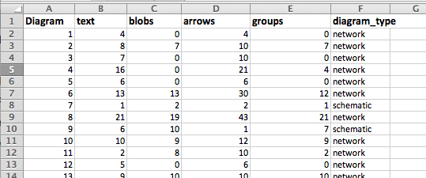
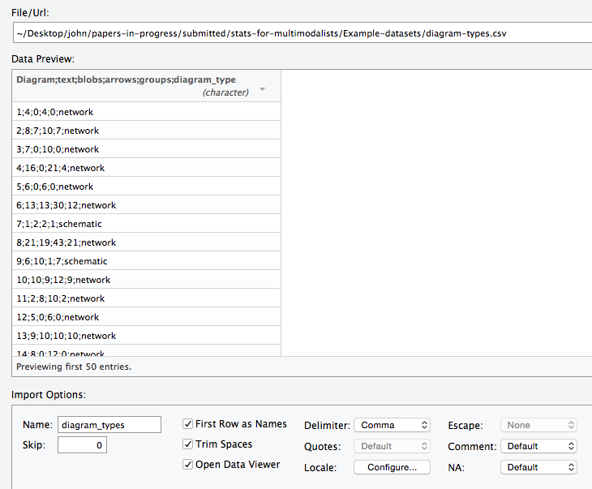
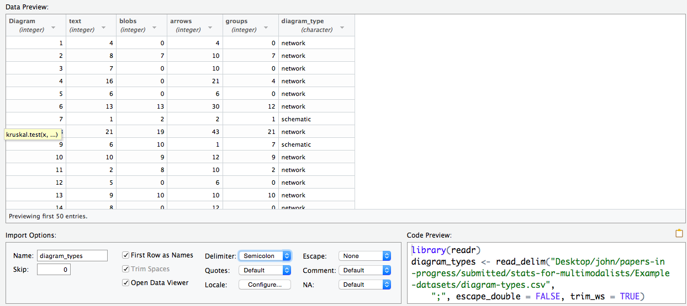
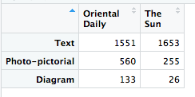

# Statistics for Multimodality: why, when, how – an invitation

This repository accompanies the paper [Statistics for Multimodality: why, when, how – an invitation](https://doi.org/10.31235/osf.io/7j3np). Here we show you how to perform the analyses described in the paper step-by-step. This will not be a full introduction to R – there are several very good resources available for this in any case and we will give some links [below](#Literature-and-additional-resources). What we will show is how to go from nothing to the state of being able to execute the code examples in the paper. You can then build on this, preferably by consulting some of the other more detailed introductions that are available.

## Installing R

Before running any R code, you have to install the R program on your computer; we will assume that this has not been done and you are using a computer without R already present. In fact, we will recommend installing two programs: the basic 'R engine' that does all the work, and a further 'development environment' that makes it easy to create R programs, edit and save them, and run them to get results. Both are free software and are available for Windows, Mac OS X, and Linux operating systems. 

To install the R engine, you need to go to the relevant website for the R project and download the installation program that is appropriate for your operating system. The core R website is at: https://www.r-project.org/. 

The development environment we recommend for using R is called RStudio. This also has to be downloaded and installed. The website for RStudio is: https://www.rstudio.com/. 

## How to use this repository
For the present, we list here some of the basic instructions and bits of code that let you carry out the examples in the paper and load data of your own. This may well become more elaborated as time goes on, and if there are specific requests, readers are invited to get in contact with us directly.

## Loading data into R
As stated in the paper, loading data into R is quite straightforward, so we describe this here rather than taking up space in the published paper. You can also then directly copy bits of code as required. We will illustrate how to get data from Excel or some other spreadsheet program into R so that you can run the tets that are described in the paper. Note that that there are always several ways of managing to import data into R; we describe what we consider the easiest way here.

We'll assume to get started that you have the data you want to analyse in a spreadsheet in some programme like Excel; the first step is then to 'export' that data in a very simple format of comma-separated-values (csv). All speadsheet programmes allow you to do this, just use 'save as' or its equivalent. A csv-file does what it says -- it simply includes a table where the rows of table contain the various values of your data separated by commas (or some other easily identifiable character, such as a semicolon). Data stored in this form should always include single values in each cell and formatting is completely ignored: they are what are described in the paper as *data tables*, they are *not* 'display tables'!
  
The data for our first case study concerned the number of text blocks in different types of diagrams, network diagrams and schematic diagrams. Example Excel files for these data can be found 
[here](./networks.xlsx) (networks) 
and [here](./schematics.xlsx) (schematics). These are not how the data were originally stored, we will describe how to set up the data more sensibly below because then we can show some more of the ways that R makes this very easy to process. Each of the files here consists of a simple list of numbers in a single column. These could be a sequence of measurements or any other values. For the present example they are just the counts of 'text blocks' found in each of a collection of diagrams: i.e., each row is a diagram, and the number is the count of text blocks in that diagram.

For processing with R, we then save this information as a csv file using the respective 'save as' command of the spreadsheet program being used. If we do this for each file, we get two new files, which we've named here as: 'networks-data.csv'  and 'schematics-data.csv'. 
If you have installed R and are using RStudio as we suggested above, then there is the simple command, probably upper right, to 'Import Dataset'. This gives a couple of options and the relevant one is 'From text (readr)'. There is an option for importing directly from the Excel files (which end in .xslx) as well, but that is only for Excel files and so we stick with the more general method for csv files here -- both methods would give the same result.


When you click this, the following window gets popped up and you should follow the numbered instructions to actually get your data into R.


When 'import' is clicked, all that happens is that R takes the code that was created as shown in (3) and 'executes' it, i.e., carries out the instructions given there. This is shown directly in the main RStudio window and is exactly the same as if you (or anyone else) had just typed in the commands. This is the first example then of how doing work with R is *self-documenting* in the sense that you always have a precise record of what was done to which data. This means then that the RStudio main windows then looks as following:

 

In the console pane, lower left, we can see that the code constructed in the previous
step has simply been copied in. R reports on what it is doing after each line. The first line tells R to load the library that knows how to deal with csv files, called 'readr'. Second, the
instruction

```networks_data <- read_csv( ... )```

is the line that tells R to read the csv file and call the result 'networks_data'. This is
the name that we can then use to manipulate the data further as we shall see in a moment; note here that the hyphen in the original file name has been converted to an underscore because the hyphen has a special meaning in R. Upper left
in the window we can see the result of the R command

```View( networks_data )```

which just tells R to show what is in the data called 'networks_data'; we'll return to the exact format of this
data, which in R is called a *dataframe* in the next section. Upper right we see a summary
of what data R currently knows about, i.e., either we have created by running code or
by importing. This summary says that the dataframe called 'networks_data' currently has
21 values (or 'observations' since R is principally for doing statistics and taking particular values of
some variable is often seen as taking 'observations') of a variable, i.e., we are only measuring one thing here, the number of text blocks, which are then all in a single column just as they were in the original Excel and csv files.

So this corresponds to a table that begins like this:

 |   |  X1 |
 ----- | --- |
*1* | 1 |
*2* | 6  |
*3* | 3 |
*4* | 4 |
*5* | 9 |
... | ... |
*n* | ... |

Since our original spreadsheet did not give a name for the column of values/observations, R makes up a name for the column here automatically, that is the 'X1' at the top. We will see in the next section how we can also just give names in the original spreadsheet and then these will be taken over to the R dataframe that we get when we import. The numbers running down the lefthand side of the table are just the row numbers.

Finally, we can then do exactly the same for the schematics data file as well. That gives
us two dataframes, one called 'networks_data' and the other called 'schematics_data'. The next step is then to manipulate these tables so that we can run the stastistical tests described in the paper on them.

## Manipulating data with R: i.e., pushing it into shape for easy processing

### Extracting sets of values from dataframes

If you have loaded the data as described in the previous section, then you can just perform the tests as given in the paper. More specifically, we can use the R operator of *selecting columns* to compare any collections of measurements or scores from a bigger table of data, or dataframe. This is usually needed because the particular statistical functions that we need just want to get the values or counts that they need to do their calculations with. Dataframes usually have much more information in them because these are used in R for organising whole sets of data. 

So, if we want to get just the values in the X1 column of our dataframe 'networks_data' (which in this case is the only column but we still have to tell R to select it), we write:

```networks_data$X1```

the '$' is the column selection operator, and the 'X1' is the name of the column we want to get values from. So this R code can be read as 'get all the values in the dataframe networks_data that are in the column called X1'. 

### Running some basic descriptive statistics

When we have all the values, we can also store them somewhere safe so that we can use them again and again. For example, if we want to keep them in a store called 'networks', we can write:

```networks <- networks_data$X1```

As above, the R operator '<-' just takes what ever the value is on the righthand side (i.e., here all the individual values in the selected column) and stores this in the *variable* named on the lefthand side, i.e. 'networks'; so networks then just contains the values or numbers from the column. These numbers are simply kept as an array of numbers, not a dataframe, and with this we can perform the basic descriptive statistics as described in the paper, such as:

```mean( networks )```

or

```sd( networks )```

and get the results that we saw in the paper.

### Extracting values from more complicated data frames

As noted above, we would rarely have spreadsheets with just single columns of numbers in them; it would be more usual to have a whole collection of data giving different kinds of judegements, measurements or counts for some particular data item. So the rows would typically be a data item and the columns would have all the various responses for that data item. It is just as straightforward to import these more complicated sets of data into R as it was for the simple case. So now lets take a more realistic example of a spreadsheet with different kinds of values in it and use the column selection operator to perform some different tests on that data.

This example contains more information about diagram types, similar to that used above but now with more detail and some actual analysis counts in it. We can see a screenshot of this as it looks in a typical spreadsheet program such as Excel like this:



Here each row is a particular diagram from the dataset and the various columns then give information about that diagram. This is the form that one would use for most collections of data: the rows could be participants in an experiment, webpages, shots in a video, images in a textbook, or whatever. The columns are then the particular properties that we have analysed, or classified, those data items with. It is then our task, using R and statistical methods, to find out if there are any interesting patterns or relationships in that data. Separating out the process of collecting and recording the data from the process of looking for relations means that we can focus particularly on doing the best job in each stage and is always to be strongly recommended. 

First, as usual, we need to get this information from the spreadsheet into R, which we do exactly as described above. We save the data as a csv-file and then import this into R. This gives us a dataframe that contains precisely the same information as the spreadsheet and which we can then use for exploration. The corresponding csv file can be downloaded here: [diagram type spreadsheet](./diagram-types.csv). 
We can go to the import data tool as described above and make sure that we have selected the right options in the preview window of the tool: when we have the right options, the preview should actually look very similar to how the data appeared in the spreadsheet prorgram. If it looks different, for example by failing to separate columns properly, then we probably still need to tell R which character is actually being used to separate columns, etc. Practising with this by trial and error should quickly give you a feel for how this works. This is what the preview window looks like, for example, with the delimiter still left at commas (the default for Excel when running in English but not in German!):



When we click the 'delimiter' field below the preview window and select semicolon instead of comma, then the preview window changes as follows:



Here you can see as well that as default R has assumed that the first row of the spreadsheet contains the names of the columns, which was correct: i.e., the 'first row as names' field was ticked. This means that our dataframe will have the proper column names and not the internally generated name 'X1', etc. as above. The code that will read this file is as it appears in the window lower right. Clicking 'import' then executes the code and the dataframe is loaded. This is then also visible in the Rstudio data view as shown here:


Pretty much, therefore, as it was in the spreadsheet image above; but now we can use all of the R tricks for processing the data further.

Now we already know how to get individual columns: for example, if we wanted now to see the number of 'texts' in each of the diagrams, we just need to get 'text' column, which we can do by writing:

```diagram_types$text```

This is just the column of numbers in that column as before. This doesn't really help us to test differences between different types of diagrams, though, because now all the network diagrams and schematic diagrams are mixed up. But since this information is available in the 'diagram_type' column it is easy just to take the text counts for each type of diagram separately. We won't worry about the R syntax at this point very much, you can work through examples as your confidence grows, but to pick out just the rows of the dataframe for networks, i.e., for those diagrams that are of type 'network, we can just write:

```diagram_types[diagram_types$diagram_type=="network",]```

the square brackets allow us to pick particular rows (or columns) and the expression in the square brackets just says which rows we want, i.e., all those where the value of 'diagram_type' in that row equals ('==' in R-speak) 'network'. Note that the '$' operator in the middle is just the same as before, i.e., it says get all the values in the column 'diagram_type'. The double equals sign then says we are only interested in those values which are 'network' and putting them in the square brackets (with a comma to say that we want rows not columns) does the final selection. 

Then, finally, if we just want the numbers in the 'text' column of this extracted data frame, we can use the '$' operator again, like this:

```diagram_types[diagram_types$diagram_type=="network",]$text```

If it is easier to follow, you could also break this down into smaller steps rather than doing it all at once. That involves 'saving' some of the values as we go along and using them later. For example, in the following we first make a smaller dataframe just containing the network diagram information, and then select the 'text' column with that:

```
network_diagrams <- diagram_types[diagram_types$diagram_type=="network",]
texts_in_networks <- network_diagrams$text
```

We can so this for any rows and columns, of course, and so get our numbers for doing the actual statistical tests. If we wanted, for example, to find the average (mean) number of arrows in schematic diagrams, we could write the following:

```mean( diagram_types[diagram_types$diagram_type=="schematic",]$arrows )```

which should give you the value back of 4.285; the mean for network diagrams is 13.015 - we'll leave the code for this as an exercise. 

Having all the information is the same dataframe is very useful for more advanced tests as well. For example, what if we wanted to see if we could predict the type of diagram by knowing the number of texts and the number of arrows in a diagram? - the information we need is all there in the single dataframe and so is already ready for R to do the work (which would be another single line of R code!).

### Saving R code as a record of what was done on what data


## Comparing measurements and counts: t-test and chi-square test

### t-test
As described in the paper, the t-test is a way of finding whether two collections of data have significantly different means or not: if they do, then there are good grounds for considering there to be some difference between data collected according to the two conditions compared. Performing a t-test in R is extremely easy - first, as usual, here is a csv-file containing two columns of numbers, which correspond to measured or observed values from two samples, regardless of how these were collected: [here](./t-test-data-same-1.csv) (test data for the t-test).

Lets now load these into R using the usual csv import mechanism described above, so that we should end up with a data frame with the somewhat unwieldy name t_test_data_same_1; that is a bit of a mouthful, so we put the data in a variable with a simpler name just to help. So, the code generated to load the csv file automatically is the following:  

```
library(readr)
t_test_data_1_same <- read_delim( "... location of file ... /t-test-data-1-same.csv", ";", escape_double = FALSE, col_names = FALSE, trim_ws = TRUE) 
```

Lets rename the data frame (we could also do this by changing the generated R code directly of course):

```data <- t_test_data_1_same```

As noted before, this data frame has two columns; we didn't specify any names for these two columns, so they get the R default names 'X1' and 'X2', also as above. This means that the data from the first group is accessible with the extraction expression:

```data$X1```

and the second similarly. Performing a t-test is then just:

```t.test( data$X1, data$X2 )```

giving the result:

```
	Welch Two Sample t-test

data:  data$X1 and data$X2
t = -0.75614, df = 37.952, p-value = 0.4542
alternative hypothesis: true difference in means is not equal to 0
95 percent confidence interval:
 -11.583743   5.283743
sample estimates:
mean of x mean of y 
    62.70     65.85 
```

which tells us that there is no significant difference between the means of the two data sets (i.e., 62.7, 65.85), because the p-value is 0.4252. This is the example data used in the statistics chapter of our introduction to multimodality: Bateman, Wildfeuer and Hiippala (2017).

Note also that there are websites that do similar tasks for you - for example, copying the data of the two columns into the website https://www.socscistatistics.com/tests/studentttest/default2.aspx quickly gives the same results, but without the self-documentation that using R provides you with.

### chi-square test

Now lets do exactly the same for the chi-square test. Here we take the data from Kong as given in the paper: [here](./kong-data.csv) (Kong's data comparing the Sun and the Oriental Daily). The structure of this data frame is a little more interesting as, as described in our paper, we are dealing here with a 2x3 contingency table, with two newspapers and counts for three kinds of multimodal information: text, photographs and diagrams. This means that we should obtain both sensible rows and columns in the resulting data frame when we import it. Using the import tool as before to create the data frame generates the following code:

```
ibrary(readr)
> kong_data <- read_delim("... location of file ... /kong-data.csv", ";", escape_double = FALSE, trim_ws = TRUE)
```

more or less as before. The first column is where the names of the rows ends up; this is not ideal and there are other ways of reading files that would grab the row names directly, but we will leave that for now. The important information we need is given by the counts in the two columns (corresponding to the two newspaper) in each row (corresponding to the types of multimodal information). Since these latter are just the final two columns, we already know how to get these counts individually for each newspaper: for example, we could use the extraction expression:

```
> kong_data$`Oriental Daily`
[1] 1551  560  133
```
to get the counts for that newspaper. 

Now, the chi-square test works with a contingency table, so we have to make sure that we have an appropriately organised table to pass on to the R-function that does the work. This contingency table should have rows for one of the variables being compared and columns for the other variable. It is important that you get the shape of this table right, otherwise the functions might just produce nonsense values or error messages that have nothing to do with the actual values that you want to compare. From loading in our kong_data data frame, we get a table, but one which is not quite the right shape. We have one set of values in each column, which is close, but we also have an extra column with row names (as you can see if you look at the value of the variable kong_data in R) as well: this latter is extra to requirements. The chi square and related functions need to have the right shape table given to them, otherwise they cannot work out the proper degrees of freedom and, indeed, would not know just which bits of the data you want to compare.

We've already seen how we can get the values that interest us from the columns, so one way of getting the data in a properly shaped table would be as follows, where we simply grab the values we need and recombine them in a 'data frame' representing the table. You can do this as follows:

```
> r <- data.frame( kong_data$`Oriental Daily`, kong_data$`The Sun` )
```

This makes a data frame called 'r' (short for results) that has just the values we want and nothing extra.  if we look at the value of 'r'  we have precisely the values in the contingency table that we want, as we can see in the following:


And, of course, you could even just make the same result by typing in the numbers in your data: i.e., you'd get the same result (at least in terms of the shape of the table) by typing:

```
> r <- data.frame( c (1551, 560, 133), c (1653, 255, 26) )
```

which uses R's collect function to collect numbers together into lists. But clearly you should not really be retyping information that you already have in your computer in any case! It pays to be 'lazy': a little more thought usually saves a lot of time down the road.

Then, when you have tables such as these, then the chi-square test is straightforward:

```
> chisq.test( r )

	Pearson's Chi-squared test

data:  r
X-squared = 167.31, df = 2, p-value < 2.2e-16
```

So, again, we see that the differences between the various conditions are highly significant.

As suggested above, manipulating data so as to push it into shape for the various statistical tests is a common practice in R and R makes it relatively straightforward, usually offering several ways to achieve the same effect. Searching on the web for the particular task that you want to perform is usually the best way of getting to solutions very quickly because someone will usually have wanted to do the same before! As an example and to offer a bit more practice with R, here is a slight more 'clever' (some might say contorted or 'quick and dirty'!) way of turning the original data that we read in above (i.e., the one with the extra column containing the row names) to a proper data frame that only includes the values we want and, different to before, now has proper column *and* row names:

```
r <- as.data.frame( kong_data )
rownames( r ) <- r[, 1]
r <- r[, -1]
```

what this does in words is (line-by-line): take a copy of the data that we just imported in kong_data and call it r. Use the values in all of the first column (indicated by the square brackets after r to select a particular slice or portion of the table overall) to set the names of the rows of that data frame (with rownames). Then take all the columns *apart* from the first one (indicated by using '-1' as the column number) and make this the value of r. This last step just throws away the redundant column we had with the row names in it. You can try this out line by line in R and look at what happens to the value of 'r' after each step to see what is going on. Remember that R can do these kinds of operations for enormous tables so using large bodies of data is generally straightforward. After doing this, if we look at this newly made value of 'r', we can see that it has precisely the same form (2x3) as the table we made above. One 'advantage' to this last approach is  that we didn't need to take the table apart and then put it back together again, but it does not really make much difference how you get to the final table, as long as it has the form needed. Note though that the rows are now given proper names rather than just numbers seen in the examples above! So when we look at the data frame again, we see the following:



There are a range of similar tests that one can perform with the data in this form. For example, Fisher's exact test is often considered to be more reliable than the chi-square test, especially when the counts are low. Here is how we can perform the test in R:

```
> fisher.test( r )

	Fisher's Exact Test for Count Data

data:  r
p-value < 2.2e-16
alternative hypothesis: two.sided
```

In this case we obtain more or less the same result because the counts were in any case quite high and so we were not running into accuracy problems with chi-square anyway.

And, again, there are some online websites where you could also type in the values of the contingency table and get the same results, for example: https://www.socscistatistics.com/tests/chisquare2/default2.aspx

## Measuring statistical power

A large number of effect size online calculators for different statistical tests can be found here: http://www.psychometrica.de/effect_size.html. The paper sets out some of the basic ways of using these for the tests described in the paper.

## Measuring agreement between annotators
Described in the paper.

## Additional resources and useful links

* [Best practice for preparing data files](http://www.sthda.com/english/wiki/best-practices-in-preparing-data-files-for-importing-into-r)


## Further Reading and Literature
To be extended.
